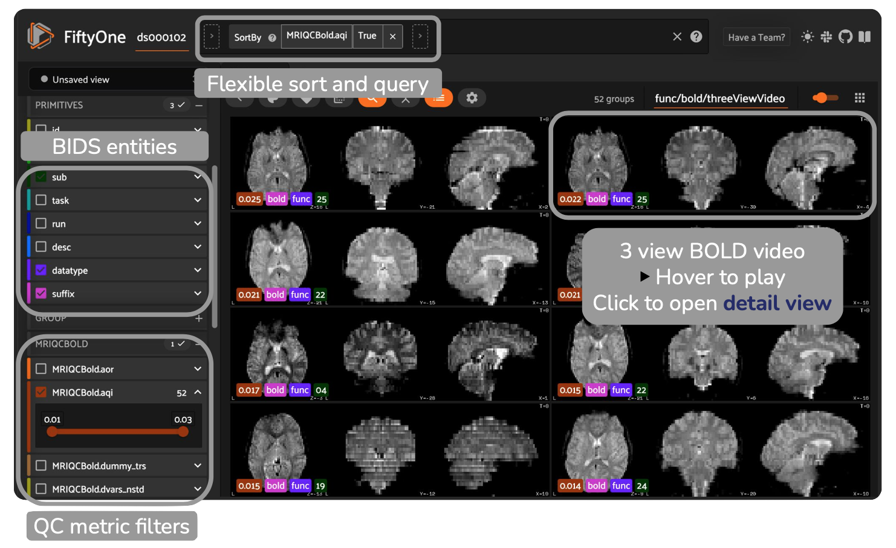

# NiftyOne

[](https://github.com/childmindresearch/niftyone/actions/workflows/test.yaml?query=branch%3Amain)
[](https://codecov.io/gh/childmindresearch/niftyone)
[](https://github.com/astral-sh/ruff)

[](https://github.com/childmindresearch/niftyone/blob/main/LICENSE)
[](https://childmindresearch.github.io/niftyone)



NiftyOne is a platform for bulk visualization of large-scale neuroimaging datasets, built upon [FiftyOne](https://docs.voxel51.com/).

## Installation

For stability, NiftyOne is recommended to be installed in it's own environment.

```bash
python -m venv niftyone-venv
source niftyone-venv/bin/activate

pip install -U pip
pip install git+https://github.com/childmindresearch/niftyone
```

## Quick start

Below are some commands to help you quickly get started.

### 1. Generate participant figures

```bash
niftyone bids_dir output_dir participant
```

### 2. Collect participant figures into a FiftyOne dataset

```bash
niftyone bids_dir output_dir group
```

### 3. Launch FiftyOne app

```bash
niftyone bids_dir output_dir launch
```
