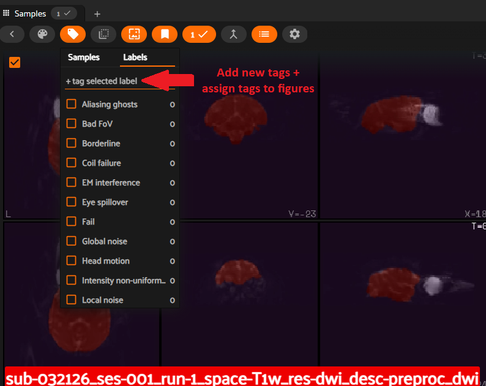

# Sharing QC annotations

NiftyOne enables users to interactively create QC annotations as tags within
the application.

Annotations are saved to a JSON file when the application is closed, allowing QC
annotations to be easily shared with others. The JSON file can be found in the output
directory at `output_dir/QC/<dataset_name>_tags.json`.
